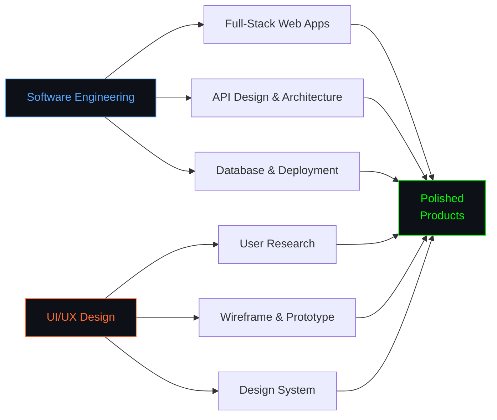

<div align="center">

[](https://github.com/rizkan-jpeg)

# Rizkan Aziz

[](https://git.io/typing-svg)


</div>

```python
class RizkanAziz:
    def __init__(self):
        self.name = "Rizkan Aziz"
        self.role = ["Software Engineer", "Full-Stack Developer", "UI/UX Designer"]
        self.location = "Banda Aceh, Indonesia"

    def tech(self):
        return {
            "languages": ["JavaScript", "C++", "Python", "PHP"],
            "frontend": ["React", "Vue.js", "Tailwind CSS", "HTML5", "CSS3"],
            "backend": ["Node.js", "Rivest–Shamir–Adleman", "Laravel", "FastAPI", "REST API", 'Midtrans"],
            "database": ["MySQL", "MongoDB", "Firebase"],
            "design": ["Figma", "Affinity", "Canva", "Prototyping", "Adobe Illustrator"],
            "tools": ["Git", "VS Code"],
        }

me = RizkanAziz()
```

```
Software Engineer and UI/UX Designer who bridges design and code. I design
intuitive interfaces in Figma and turn them into fast, scalable full-stack
applications — from user research and prototyping to APIs and deployment.
```

<div align="center">

</div>

## Tech Stack

<div align="center">

[](https://skillicons.dev)  
[](https://skillicons.dev)  
[](https://skillicons.dev)  
[](https://skillicons.dev)  
[](https://skillicons.dev)  

</div>

## Focus Areas



<!-- ## Experience

<!-- Ganti dengan pengalaman nyata kamu: magang, freelance, organisasi, lomba, dll. -->

```mermaid
timeline
    title Professional Journey

    2023 : Mulai Belajar Web Development
         : Eksplorasi UI/UX Design

    2024 : Posisi / Proyek Pertama
         : Nama Organisasi atau Klien

    2025 : Posisi / Proyek Kedua
         : Nama Organisasi atau Klien

    2026 : Software Engineer & UI/UX Designer
         : Ongoing Projects
```-->

<div align="center">

</div>

## Open to Collaboration

<div align="center">

|  **Web Development**<br/>Full-Stack Applications<br/>Landing Page & Company Profile<br/>Dashboard & Admin Panel |  **UI/UX Design**<br/>Wireframe & Prototype<br/>Mobile & Web Interface<br/>Design System |  **Backend & API**<br/>REST API<br/>Database Design<br/>Authentication & Deployment |  **Open Source**<br/>Community Projects<br/>Code Review<br/>Developer Tooling |
| :---: | :---: | :---: | :---: |

</div>

<div align="center">

</div>

<div align="center">


*"Good design is how it looks and feels — great engineering is how it works."*

<!-- Ganti semua link di bawah dengan milik kamu -->
[](https://instagram.com/rizkan.az)
[](https://wa.me/6285243588585)
[](mailto:rizkanaziz1@gmail.com)
[](https://linkedin.com/in/rizkan-aziz-02a284380)

</div>
